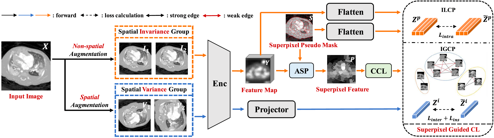

<div align="center">

# SuperCL: Superpixel Guided Contrastive Learning for Medical Image Segmentation Pre-Training

[](https://ieeexplore.ieee.org/abstract/document/11371598)
[](https://doi.org/10.1109/TIP.2026.3657233)
[](https://github.com/stevezs315/SuperCL)
[](LICENSE)
[](https://python.org)


**Shuang Zeng, Lei Zhu, Xinliang Zhang, Hangzhou He, Yanye Lu***

*MILab, Department of Biomedical Engineering, Peking University, Wallace H. Coulter Department of Biomedical Engineering, Georgia Institute of Technology and Emory University*

*\* Corresponding Author: yanye.lu@pku.edu.cn*

</div>

---

## Introduction

Medical image segmentation suffers from limited annotated data. Most existing contrastive learning (CL) methods either focus on instance-level or pixel-to-pixel representations, ignoring characteristics between intra-image similar pixel groups, and rely on manually set thresholds for contrastive pair generation.

We propose **SuperCL**, a novel contrastive learning framework for medical image segmentation pre-training. SuperCL exploits the structural prior and pixel correlation of images via two novel strategies:
- **ILCP** (Intra-image Local Contrastive Pairs Generation): pixel-level supervised CL guided by superpixel pseudo masks
- **IGCP** (Inter-image Global Contrastive Pairs Generation): instance-level supervised CL with two novel modules ASP and CCL

> **TL;DR:** SuperCL uses superpixel maps as pseudo masks to guide supervised contrastive learning for medical image segmentation pre-training, outperforming 12 SOTA methods across 8 datasets.

---

## News
- **[2026-05-09]** I am excited to present our work SuperCL as a poster at VALSE 2026 in Wuhan.
- **[2026-02-09]** Paper published in IEEE Transactions on Image Processing (TIP), Vol. 35, 2026!
- **[2026-01-17]** Paper accepted by IEEE Transactions on Image Processing (TIP)!
---

## Method Overview



SuperCL builds upon a standard CL framework with two branches:

1. **Spatial Invariance Group** → pixel-level projection → **ILCP** → $\mathcal{L}_{intra}$
2. **Spatial Variance Group** → instance-level projection → **IGCP** → $\mathcal{L}_{inter}$ ($\mathcal{L}_{ins} as baseline CL loss$)

The total loss is:

$$\mathcal{L}_{total} = \lambda_1 \mathcal{L}_{ins} + \lambda_2 \mathcal{L}_{intra} + \lambda_3 \mathcal{L}_{inter}$$

**Key modules:**
- [**ILCP**](assets/ILCP.png): Uses SLIC superpixel map to generate pseudo masks; pixels in the same superpixel cluster are treated as positive pairs
- **ASP** (Average SuperPixel Feature Map Generation): Generates a reliable representation for inter-image affinity computation
- **CCL** (Connected Components Label Generation): Generates a weak label via nearest-neighbor graph and Hoshen-Kopelman algorithm

---

## Main Results

SuperCL outperforms **12 SOTA methods** across **8 medical image datasets** (4 multi-organ + 4 ROI-based):

| Dataset | Annotation | Previous Best DSC | SuperCL DSC | Improvement |
|---------|-----------|------------------|------------|------------|
| MMWHS | 10% | 87.10 | **90.26** | +3.16% |
| CHAOS | 10% | 63.61 | **69.05** | +5.44% |
| Spleen | 10% | 73.40 | **81.29** | +7.89% |
| ACDC | 10% | 84.91 | **86.06** | +1.15% |

> SuperCL with **25% annotations** achieves comparable performance to fully-supervised training with **100% annotations**.

---

## Installation

### Requirements

```
Python >= 3.8
PyTorch >= 1.10
CUDA >= 11.1
scikit-image
```

### Setup

```bash
# Clone the repository
git clone https://github.com/stevezs315/SuperCL.git
cd SuperCL

# Create conda environment
conda create -n supercl python=3.8
conda activate supercl

# Install dependencies
pip install -r requirements.txt
```

---

## Model Weights

Pre-trained model weights will be released soon.

| Model | Pre-train Dataset | Backbone | Download |
|-------|------------------|----------|----------|
| SuperCL-CHD | CHD (CT, 17525 slices) | UNet | Coming soon |
| SuperCL-BraTS | BraTS2018 (MRI, 39064 slices) | UNet | Coming soon |
| SuperCL-KiTS | KiTS2019 (CT, 32332 slices) | UNet | Coming soon |

Download and place weights in:

```
checkpoints/
├── SuperCL_CHD/
│   └── pretrained.pth
├── SuperCL_BraTS/
│   └── pretrained.pth
└── SuperCL_KiTS/
    └── pretrained.pth
```

---

## Dataset Preparation

### Pre-training Datasets (Upstream, Unlabeled)

| Dataset | Modality | Size | Usage |
|---------|----------|------|-------|
| CHD | CT | 68 volumes / 17525 slices | Multi-organ pre-training |
| BraTS2018 | MRI | 351 patients / 39064 slices | MRI pre-training |
| KiTS2019 | CT | 210 patients / 32332 slices | ROI CT pre-training |

### Fine-tuning Datasets (Downstream)

| Dataset | Modality | Task | Size |
|---------|----------|------|------|
| ACDC | MRI | Multi-organ (LV/RV/Myo) | 100 patients |
| MMWHS | CT | Multi-organ (7 structures) | 20 patients |
| HVSMR | MRI | Multi-organ (Blood pool/Myo) | 10 patients |
| CHAOS | MRI | Multi-organ (4 regions) | 20 patients |
| MSD-Heart | MRI | ROI (Left atrium) | 20 patients |
| MSD-Hippocampus | MRI | ROI (Hippocampus) | 260 patients |
| MSD-Spleen | CT | ROI (Spleen) | 41 patients |
| ISIC2018 | Dermoscopy | ROI (Skin lesion) | 2594 images |

### Data Structure

```
data/
├── upstream/
│   ├── CHD/
│   ├── BraTS2018/
│   └── KiTS2019/
└── downstream/
    ├── ACDC/
    ├── MMWHS/
    ├── HVSMR/
    ├── CHAOS/
    ├── MSD_Heart/
    ├── MSD_Hippocampus/
    ├── MSD_Spleen/
    └── ISIC2018/
```

---

## Pre-training

```bash
# Pre-train on CHD dataset (CT, for multi-organ segmentation)
python pretrain.py \
    --dataset CHD \
    --data_path data/upstream/CHD \
    --output_dir checkpoints/SuperCL_CHD \
    --epochs 100 \
    --batch_size 16 \
    --lr 0.1 \
    --temperature 0.1 \
    --lambda1 1.0 \
    --lambda2 1.0 \
    --lambda3 0.5 \
    --superpixel_num 100 \
    --superpixel_compactness 10

# Pre-train on BraTS2018 (MRI)
python pretrain.py \
    --dataset BraTS \
    --data_path data/upstream/BraTS2018 \
    --output_dir checkpoints/SuperCL_BraTS \
    --epochs 100

# Pre-train on KiTS2019 (CT, for ROI segmentation)
python pretrain.py \
    --dataset KiTS \
    --data_path data/upstream/KiTS2019 \
    --output_dir checkpoints/SuperCL_KiTS \
    --epochs 100
```

### Key Pre-training Parameters

| Parameter | Value | Description |
|-----------|-------|-------------|
| `--epochs` | 100 | Pre-training epochs |
| `--batch_size` | 16 | Batch size per GPU |
| `--lr` | 0.1 | Initial learning rate (cosine decay to 0) |
| `--temperature` | 0.1 | Temperature τ for contrastive loss |
| `--lambda1` | 1.0 | Weight for $\mathcal{L}_{ins}$ |
| `--lambda2` | 1.0 | Weight for $\mathcal{L}_{intra}$ (ILCP) |
| `--lambda3` | 0.5 | Weight for $\mathcal{L}_{inter}$ (IGCP) |
| `--superpixel_num` | 100 | Number of superpixel clusters (K) |
| `--superpixel_compactness` | 10 | SLIC compactness parameter |

---

## Fine-tuning

```bash
# Fine-tune on ACDC with 10% annotations
python finetune.py \
    --pretrained checkpoints/SuperCL_BraTS/pretrained.pth \
    --dataset ACDC \
    --data_path data/downstream/ACDC \
    --output_dir output/SuperCL_ACDC_10pct \
    --label_ratio 0.1 \
    --epochs 100 \
    --batch_size 5 \
    --lr 5e-4

# Fine-tune on MMWHS with 25% annotations
python finetune.py \
    --pretrained checkpoints/SuperCL_CHD/pretrained.pth \
    --dataset MMWHS \
    --data_path data/downstream/MMWHS \
    --output_dir output/SuperCL_MMWHS_25pct \
    --label_ratio 0.25 \
    --epochs 100 \
    --batch_size 5 \
    --lr 5e-4
```

### Pre-training → Fine-tuning Mapping

| Fine-tuning Dataset | Modality | Pre-training Dataset |
|--------------------|----------|---------------------|
| ACDC / MMWHS | CT/MRI | CHD (CT) / BraTS (MRI) |
| HVSMR / CHAOS | MRI | BraTS (MRI) |
| Spleen / ISIC | CT/Dermoscopy | KiTS (CT) |
| Heart / Hippocampus | MRI | BraTS (MRI) |

---

## Evaluation

```bash
# Evaluate on a single dataset
python eval.py \
    --model_path output/SuperCL_ACDC_10pct/best.pth \
    --dataset ACDC \
    --data_path data/downstream/ACDC

# Evaluate on all 8 downstream datasets
bash scripts/eval_all.sh
```

Metrics: **DSC** (↑), **JC** (↑), **HD95** (↓), **ASD** (↓)

---

## Project Structure

```
SuperCL/
├── assets/               # Figures and illustrations
├── checkpoints/          # Pre-trained model weights
├── data/                 # Dataset directory
├── models/
│   ├── unet.py           # UNet backbone
│   ├── supercl.py        # SuperCL pre-training framework
│   └── modules/
│       ├── ilcp.py       # Intra-image Local Contrastive Pairs
│       ├── igcp.py       # Inter-image Global Contrastive Pairs
│       ├── asp.py        # Average SuperPixel Feature Map Generation
│       └── ccl.py        # Connected Components Label Generation
├── datasets/             # Dataset loaders
├── utils/
│   ├── superpixel.py     # SLIC superpixel generation
│   └── losses.py         # Contrastive loss functions
├── scripts/              # Evaluation and training scripts
├── pretrain.py           # Pre-training entry point
├── finetune.py           # Fine-tuning entry point
├── eval.py               # Evaluation entry point
├── requirements.txt
└── README.md
```

---

## Citation

If you find SuperCL useful in your research, please cite our paper:

```bibtex
@article{zeng2026supercl,
  title     = {SuperCL: Superpixel Guided Contrastive Learning for Medical Image Segmentation Pre-Training},
  author    = {Zeng, Shuang and Zhu, Lei and Zhang, Xinliang and He, Hangzhou and Lu, Yanye},
  journal   = {IEEE Transactions on Image Processing},
  volume    = {35},
  pages     = {1636--1651},
  year      = {2026},
  publisher = {IEEE},
  doi       = {10.1109/TIP.2026.3657233}
}
```

---

## Contact

- **Shuang Zeng** (First Author): MILab, Peking University & Georgia Institute of Technology
- **Yanye Lu** (Corresponding Author): yanye.lu@pku.edu.cn

For questions and issues, please open a [GitHub Issue](https://github.com/stevezs315/SuperCL/issues).

---

## Acknowledgement

This work was supported by:
- National Natural Science Foundation of China (Grant 82371112, 62501020)
- National Key Research and Development Program of China (Grant 2025YFA1805700)
- Science Foundation of Peking University Cancer Hospital (Grant JC202505)
- China National Postdoctoral Program for Innovative Talents (Grant BX20250368)
- Peking University Medicine Plus X Pilot Program

We thank the following open-source works: [UNet](https://github.com/milesial/Pytorch-UNet), [SimCLR](https://github.com/google-research/simclr), [WCL](https://github.com/mingkai-zheng/WCL), [PCL](https://github.com/dungzb/PCL_medical).

---

## License

This project is released under the [MIT License](LICENSE).