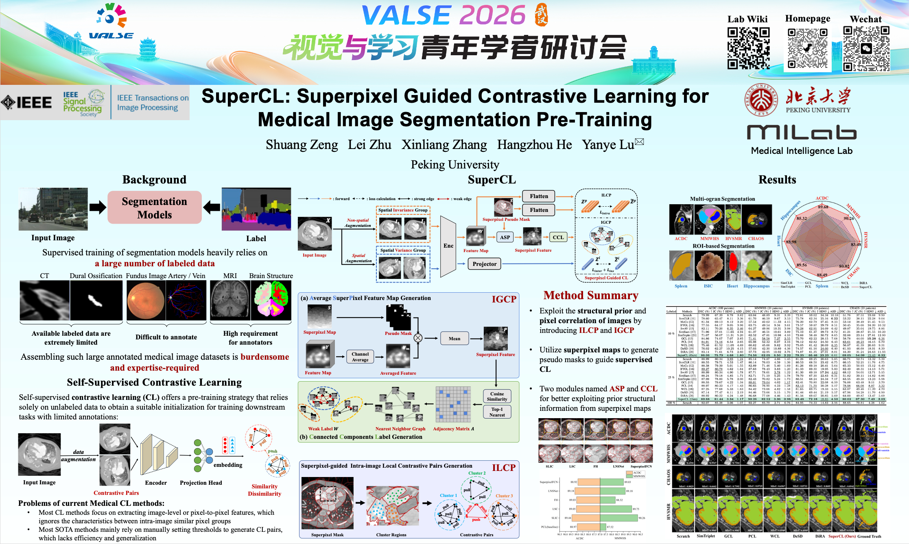

# SuperCL: Superpixel Guided Contrastive Learning for Medical Image Segmentation Pre-Training

<!-- [IEEE TIP](https://ieeexplore.ieee.org/abstract/document/11371598)
[GitHub](https://github.com/stevezs315/SuperCL)
[Homepage](https://stevezs315.github.io/) -->

[](https://ieeexplore.ieee.org/abstract/document/11371598)
[](https://github.com/stevezs315/SuperCL)
[](https://stevezs315.github.io/)

**Shuang Zeng, Lei Zhu, Xinliang Zhang, Hangzhou He, Yanye Lu***

*MILab, Department of Biomedical Engineering, Peking University*

 *Corresponding Author: [yanye.lu@pku.edu.cn](mailto:yanye.lu@pku.edu.cn)*

---

## Introduction

Medical image segmentation suffers from limited annotated data. Most existing contrastive learning (CL) methods either focus on instance-level or pixel-to-pixel representations, ignoring characteristics between intra-image similar pixel groups, and rely on manually set thresholds for contrastive pair generation.

We propose **SuperCL**, a novel contrastive learning framework for medical image segmentation pre-training. SuperCL exploits the structural prior and pixel correlation of images via two novel strategies:

- **ILCP** (Intra-image Local Contrastive Pairs Generation): pixel-level supervised CL guided by superpixel pseudo masks
- **IGCP** (Inter-image Global Contrastive Pairs Generation): instance-level supervised CL with two novel modules ASP and CCL

> **TL;DR:** SuperCL uses superpixel maps as pseudo masks to guide supervised contrastive learning for medical image segmentation pre-training, outperforming 12 SOTA methods across 8 datasets.

---

## News

- **[2026-05-09]** I am excited to present our work SuperCL as a poster at VALSE 2026 in Wuhan.
- **[2026-02-09]** Paper published in IEEE Transactions on Image Processing (TIP), Vol. 35, 2026!
- **[2026-01-17]** Paper accepted by IEEE Transactions on Image Processing (TIP)!

---

## Method Overview



SuperCL builds upon a standard CL framework with two branches:

1. **Spatial Invariance Group** → pixel-level projection → **ILCP** → $\mathcal{L}_{intra}$
2. **Spatial Variance Group** → instance-level projection → **IGCP** → $\mathcal{L}_{inter}$

The total loss is:

$$\mathcal{L}*{total} = \lambda_1 \mathcal{L}*{ins} + \lambda_2 \mathcal{L}*{intra} + \lambda_3 \mathcal{L}*{inter}$$

**Key modules:**

- **ILCP**: Uses SLIC superpixel map to generate pseudo masks; pixels in the same superpixel cluster are treated as positive pairs
- **ASP** (Average SuperPixel Feature Map Generation): Generates a reliable representation for inter-image affinity computation
- **CCL** (Connected Components Label Generation): Generates a weak label via nearest-neighbor graph and Hoshen-Kopelman algorithm

---

## Installation

```bash
conda create -n SuperCL python=3.8.16
conda activate SuperCL
pip install -r requirements.txt
```

---

## Model Weights

Pre-trained model weights: *'SuperCL/model_pth'*


| Model         | Pre-train Dataset             | Backbone |
| ------------- | ----------------------------- | -------- |
| SuperCL_CHD   | CHD (CT, 17525 slices)        | UNet     |
| SuperCL_BraTS | BraTS2018 (MRI, 39064 slices) | UNet     |
| SuperCL_KiTS  | KiTS2019 (CT, 32332 slices)   | UNet     |


---

## Dataset Preparation

### Pre-training Datasets (Upstream, Unlabeled)


| Dataset   | Modality | Size         | Usage                                |
| --------- | -------- | ------------ | ------------------------------------ |
| CHD       | CT       | 17525 slices | Multi-organ CT pre-training          |
| BraTS2018 | MRI      | 39064 slices | MRI (Multi-organ / ROI) pre-training |
| KiTS2019  | CT       | 32332 slices | ROI CT pre-training                  |


- Congenital Heart Disease (CHD) dataset, [link](https://www.kaggle.com/datasets/xiaoweixumedicalai/chd68-segmentation-dataset-miccai19)
- BraTS2018, [link](https://www.med.upenn.edu/sbia/brats2018/data.html)
- KiTS, [link](https://drive.google.com/file/d/1EuGqW59itnVXndiqOopxDSvmNIVk4ijV/view?usp=drive_link)

### Fine-tuning Datasets (Downstream)


| Dataset         | Modality   | Task                         | Size         |
| --------------- | ---------- | ---------------------------- | ------------ |
| ACDC            | MRI        | Multi-organ (LV/RV/Myo)      | 100 patients |
| MMWHS           | CT         | Multi-organ (7 structures)   | 20 patients  |
| HVSMR           | MRI        | Multi-organ (Blood pool/Myo) | 10 patients  |
| CHAOS           | MRI        | Multi-organ (4 regions)      | 20 patients  |
| MSD-Heart       | MRI        | ROI (Left atrium)            | 20 patients  |
| MSD-Hippocampus | MRI        | ROI (Hippocampus)            | 260 patients |
| MSD-Spleen      | CT         | ROI (Spleen)                 | 41 patients  |
| ISIC2018        | Dermoscopy | ROI (Skin lesion)            | 2594 images  |


- ACDC, [link](https://www.creatis.insa-lyon.fr/Challenge/acdc/databases.html)
- MMWHS, [link](https://zmiclab.github.io/zxh/0/mmwhs/)
- HVSMR, [link](http://segchd.csail.mit.edu/)
- CHAOS, [link](https://chaos.grand-challenge.org/Combined_Healthy_Abdominal_Organ_Segmentation/)
- MSD, [link](http://medicaldecathlon.com/)
- ISIC2018, [link](https://challenge.isic-archive.com/landing/2018/)

### Pre-Processing

Use the `generate_xxx.py` in the `dataset` folder to preprocess the dataset, convert the original data into .npy/.png for training and testing.

```
# convert the xxx dataset
python generate_xxx.py -indir raw_image_dir -labeled_outdir save_dir_for_unlabeled_data -unlabeled_outdir save_dir_for_unlabeled_data
```

---

## Pre-training

*bash pretrain.sh*

```bash
# Pre-train on CHD dataset (CT, for multi-organ segmentation)

CUDA_VISIBLE_DEVICES=0,1 python -m torch.distributed.launch --nnodes=1 --nproc_per_node=2 --master_port 21678 \
train_contrast.py --device cuda:0 \
--model_name UNet2D_SCL --ssl_method GPSCL \
--dataset chd --batch_size 16 --checkpoint_pretrain_interval 10 --epochs 100 \
--data_dir "datasets/chd/out_unlabeled/" --do_contrast --lr 0.01 \
--experiment_name your_experiment_name_ --save SuperCL --slice_threshold 0.1 \
--temp 0.1 --patch_size 512 512 --initial_filter_size 32 --classes 512 \
--contrastive_method 'superpixel_pcl' --GPU_Name '0,1 of M7' --scale_factor 0.25 \
--pixel_use --parallel DDP --n_segments 100 --compactness 10 --super_pixel \
--reduce_memory_mode 'sample' --stride 16 --AMP --lambda_sp_intra 1.0 --lambda_wcl 0.5 \

# Pre-train on BraTS2018 (MRI for multi-organ / ROI segmentation)

CUDA_VISIBLE_DEVICES=0,1 python -m torch.distributed.launch --nnodes=1 --nproc_per_node=2 --master_port 21182 \
train_contrast.py --device cuda:0 \
--model_name UNet2D_SCL --ssl_method GPSCL \
--dataset BraTS --batch_size 32 --checkpoint_pretrain_interval 10 --epochs 100 \
--data_dir "datasets/BraTS_unlabeled/unlabeled" --do_contrast --lr 0.01 \
--experiment_name your_experiment_name_ --save SuperCL --slice_threshold 0.1 \
--temp 0.1 --patch_size 192 192 --initial_filter_size 32 --classes 512 \
--contrastive_method 'superpixel_pcl' --GPU_Name '0,1 of M7' --scale_factor 0.25 \
--pixel_use --parallel DDP --n_segments 100 --compactness 10 --super_pixel \
--reduce_memory_mode 'sample' --stride 1 --AMP \
--mode pretrain --lambda_sp_intra 1.0 --lambda_wcl 0.5 \

# Pre-train on KiTS2019 (CT, for ROI segmentation)

CUDA_VISIBLE_DEVICES=0,1 python -m torch.distributed.launch --nnodes=1 --nproc_per_node=2 --master_port 25634 \
train_contrast.py --device cuda:0 \
--model_name UNet2D_SCL --ssl_method GPSCL \
--dataset KiTS --batch_size 16 --checkpoint_pretrain_interval 10 --epochs 100 \
--data_dir "/datasets/KITS/" --do_contrast --lr 0.01 \
--experiment_name your_experiment_name_ --save SuperCL --slice_threshold 0.1 \
--temp 0.1 --patch_size 512 512 --initial_filter_size 32 --classes 512 \
--contrastive_method 'superpixel_pcl' --GPU_Name '0,1 of M7' --scale_factor 0.25 \
--pixel_use --parallel DDP --n_segments 100 --compactness 10 --super_pixel \
--reduce_memory_mode 'sample' --stride 16 --AMP --sp_method 'SLIC' \
--lambda_sp_intra 1.0 --lambda_wcl 0.5 \

```

---

## Fine-tuning

*bash finetune.sh*

```bash
# Fine-tune on ACDC with 10% / 25% annotations
samples=("8" "20") # 8, 20
for sample in "${samples[@]}";
do
echo "sample=${sample}";
CUDA_VISIBLE_DEVICES=0,1 python -m torch.distributed.launch --nnodes=1 --nproc_per_node=2 --master_port 24895 \
train_supervised.py --device cuda:0 --ssl_method GPSCL \
--pretrained_model_path 'model_pth/SuperCL_CHD.pth' --restart \
--batch_size 5 --epochs 100 \
--data_dir "dataset/acdc/out_labeled/" \
--lr 5e-4 --min_lr 5e-6 --dataset acdc --patch_size 352 352 \
--experiment_name ACDC_CHD_your_experiment_name_"${sample}"_ --save epochs_100_batchsize_5x2GPU_lr_5e-6-5e-4 \
--initial_filter_size 32 --classes 4 --enable_few_data --sampling_k "${sample}" \
--data_split_list data_split_list.txt \
--parallel DDP --checkpoint_finetune_interval 10 --GPU_Name '0,1' \
--model_name 'UNet2D_JCL'
done

```

## Project Structure

```
SuperCL/
├── assets/               # Figures and illustrations
├── dataset/              # Dataset loaders and preprocessing scripts
│   ├── acdc.py           # ACDC dataset loader
│   ├── BraTS.py          # BraTS dataset loader
│   ├── chd.py            # CHD dataset loader
│   ├── KiTS.py           # KiTS dataset loader
│   ├── MSD.py            # MSD dataset loader
│   ├── CHAOS.py          # CHAOS dataset loader
│   ├── ISIC.py           # ISIC dataset loader
│   ├── hvsmr.py          # HVSMR dataset loader
│   ├── mmwhs.py          # MMWHS dataset loader
│   ├── augmentation.py   # Data augmentation utilities
│   └── generate_*.py     # Dataset preprocessing/generation scripts
├── loss/
│   └── contrast_loss.py  # Contrastive learning losses
├── network/
│   └── unet2d.py         # 2D UNet backbone and variants
├── model_pth/            # Released SuperCL pre-trained weights
├── results/              # Evaluation outputs
├── runs/                 # Training logs and TensorBoard runs
├── train_contrast.py     # SuperCL pre-training entry point
├── train_supervised.py   # Fine-tuning / supervised training entry point
├── evaluation.py         # Evaluation entry point
├── pretrain.sh           # Pre-training command examples
├── finetune.sh           # Fine-tuning command examples
├── myconfig.py           # Experiment configuration
├── utils.py              # Training, validation, and superpixel utilities
├── metrics.py            # Segmentation metrics
├── lr_scheduler.py       # Learning-rate schedulers
├── data_split_list.txt   # Few-shot split definition
├── requirements.txt
└── readme.md
```

---

## Citation

If you find SuperCL useful in your research, please cite our paper:

```bibtex
@ARTICLE{supercl,
  author={Zeng, Shuang and Zhu, Lei and Zhang, Xinliang and He, Hangzhou and Lu, Yanye},
  journal={IEEE Transactions on Image Processing}, 
  title={SuperCL: Superpixel Guided Contrastive Learning for Medical Image Segmentation Pre-Training}, 
  year={2026},
  volume={35},
  number={},
  pages={1636-1651},
  keywords={Image segmentation;Contrastive learning;Annotations;Feature extraction;Training;Spleen;Image edge detection;Costs;Correlation;Chaos;Medical image segmentation;self-supervised learning;contrastive learning;superpixel},
  doi={10.1109/TIP.2026.3657233}}
```

---

## Contact

- **Shuang Zeng** (First Author): [stevezs@pku.edu.cn](mailto:stevezs@pku.edu.cn)
- **Yanye Lu** (Corresponding Author): [yanye.lu@pku.edu.cn](mailto:yanye.lu@pku.edu.cn)

For questions and issues, please open a [GitHub Issue](https://github.com/stevezs315/SuperCL/issues).

---

## Acknowledgement

This codebase builds upon [PCL](https://github.com/dewenzeng/positional_cl). We thank the authors for their excellent work and for releasing their code.

---